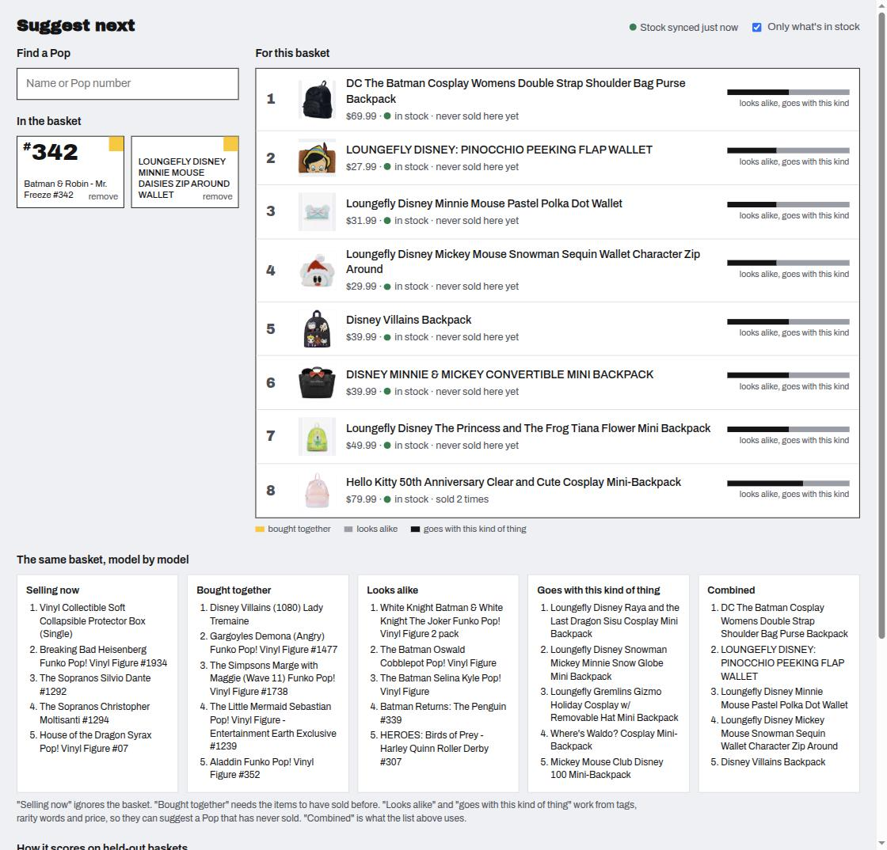

# basket-recommender

> **Write-up:** [Half of what the store sells has never sold before: why content beat every id-based model.](docs/writeup.md)

Item-to-item basket completion for a real retail store, with an offline evaluation
that is held to a protocol stated before any model was written.

The store is a Funko Pop shop with about a hundred orders a month. The data is its
actual order history, anonymized and committed to this repo, so the whole evaluation
runs from a clean clone with no credentials. Every number in this README is computed
from that snapshot by `recsys report`.

**Status: complete.** Data pipeline, evaluation harness, five model families, a
validated blend, a FastAPI service, a screen a store owner can leave open — all from
`docker compose up`, with live stock as a hard filter — and a regression gate that
CI applies to a fresh run of the evaluation on every push; numbers in
[Results](#results). The protocol below was written before any model existed.



## The data

<!-- data-table:start -->
| | |
|---|---|
| Orders | 2,653 over 25 months (2024-09-06 to 2026-09-05), median 95/month |
| Sales channel mix | pos 78%, web 11%, app 9%, draft 2% |
| Orders with a customer attached | 53% overall; 40% of in-store |
| Customers | 1,111 unique; 139 (13%) ordered twice or more; 15 ordered five or more times |
| Multi-item orders | 1,388 (52%); median 2 units per order |
| Distinct variants sold | 3,283; 61% appear in only one order |
| Top-20 variants | 6% of all units |
| Cold start (last 90 days) | 45% of line items are variants first sold inside that window |
| Catalog | 8,182 variants; 100% of sold variants still listed; tags on 99% (477 distinct) |
<!-- data-table:end -->

Three of those rows decided the design before any modelling:

- **13% repeat customers, 15 people with five or more orders.** There are no user
  histories to learn from, and in-store orders — 78% of the total — mostly have no
  customer attached at all. User-based collaborative filtering and user-item matrix
  factorization are ruled out by the data, not by preference. The problem is
  **basket completion**: given the items in front of a customer, rank the rest of the
  catalog. That framing serves a web cart, the store's app, and an in-store suggestion
  with one model.
- **61% of variants appear in exactly one order, and the top 20 sell 6% of units.**
  A popularity baseline will be weak here, and item-item co-occurrence will be sparse.
- **45% of recent line items are variants that had never sold before the last 90
  days.** New releases are most of what sells. A model that only knows item ids is
  blind to half the demand, so content features (tags cover 99% of the catalog, 477
  distinct) are the core of the cold-start path, not a refinement.

## What was cleaned out, and how much

Counts are written to [`data/public/clean_stats.json`](data/public/clean_stats.json)
on every build.

| Rule | Dropped | Why |
|---|---:|---|
| Cancelled orders | 76 orders | Never fulfilled |
| The owner's own orders | 4 orders | Test purchases, not demand |
| Fully refunded line items | 71 lines | Returned; partial refunds reduce quantity instead (13 lines) |
| Line items with no variant | 632 lines (9%) | POS tips, hand-typed custom sales, and products deleted since the sale |
| Orders with nothing left after the above | 225 orders | Baskets made entirely of the previous row |
| Duplicate variant lines within an order | 27 merged | Same item rung up twice |

The last two rows are the honest cost of this dataset: about 9% of line items and
8% of orders are gone because the product no longer exists in the catalog, so the
"still listed" figure in the table above is true by construction, not a finding.

## Anonymization

What survives: variant and product ids (public catalog identifiers), titles, tags,
prices, quantities net of refunds, the order date to the day, and a coarse sales
channel (`pos`, `web`, `app`, `draft`, `other`). Customers are a keyed hash — repeat
purchases stay linkable, the id does not survive, and the key lives outside the
repo. What does not survive: emails, names, order numbers, timestamps, and anything
else the API returned.

[`tests/test_public_data.py`](tests/test_public_data.py) asserts these invariants
against the committed snapshot on every push, so a rebuild that leaked a field
fails CI. Field-level documentation is in [`data/public/DATASET.md`](data/public/DATASET.md).

## Reproduce

```bash
git clone https://github.com/peterzemore/basket-recommender.git && cd basket-recommender
python -m venv .venv && .venv/bin/pip install -e ".[dev]"
.venv/bin/pytest -q
.venv/bin/recsys report            # the table above, from data/public/
```

Refreshing the snapshot needs a Shopify custom app with `read_orders` and
`read_products` and an env file carrying `SHOPIFY_STORE`, `SHOPIFY_CLIENT_ID`,
`SHOPIFY_CLIENT_SECRET`:

```bash
.venv/bin/pip install -e ".[pull]"
.venv/bin/recsys pull --env-file /path/to/shopify.env --lookback-days 730
.venv/bin/recsys build --exclude-emails owner@example.com
.venv/bin/recsys report --update-readme
```

## Serve it

```bash
docker compose up            # http://127.0.0.1:8150 is the dashboard  (PORT=… to change)
curl "http://127.0.0.1:8150/search?q=batman&k=3"
curl "http://127.0.0.1:8150/recommend?variant_ids=<id>,<id>&k=10"
curl "http://127.0.0.1:8150/similar/<id>"
curl  http://127.0.0.1:8150/health
```

The container carries the public snapshot and `results/serving_config.json` — the
exact configuration validation chose and the test table reports — and fits it on
the full snapshot at startup, in a few seconds. `/health` says what it was fitted
on. No credentials are needed for any of this.

| Endpoint | Returns |
|---|---|
| `GET /recommend?variant_ids=1,2&k=10&in_stock=true` | ranked items for the basket, each with a `why` block: the weighted contribution of each model in the blend |
| `GET /similar/{variant_id}` | content-only neighbours — works for an item that has never sold |
| `GET /search?q=` | title search, to find ids |
| `GET /eval` | the test results as JSON |
| `GET /health` | model, config source, fitted-on counts, stock cache status |
| `GET /` | the dashboard: find a Pop, build the basket, see suggestions with a why bar, the same basket through every model, and the held-out scores. State lives in the URL (`/?ids=1,2`), so it works with JavaScript off; a few lines of script add search-as-you-type |

**Stock is a hard filter, and it matters more than the metrics suggest.** Drop a
file named `shopify.env` next to `compose.yaml` with `SHOPIFY_STORE`,
`SHOPIFY_CLIENT_ID`, `SHOPIFY_CLIENT_SECRET` (an app with `read_inventory`) and the
service pulls on-hand quantities at startup and every 15 minutes after. With it
on, `in_stock=true` (the default) drops anything with zero on hand and every row
reports `in_stock`. Without it, the service runs identically, `in_stock` is `null`,
and `stock_filter_applied` is `false`, so a caller can tell the difference.

Checked against the live store on 2026-09-05: 40% of the catalog was in stock, and
for a Batman Pop, **all five of the unfiltered top recommendations were sold out**.
The evaluation cannot see this, which is why it is a serving rule rather than a
feature, and why the ranked list a customer sees is not the one the test table
scores.

## The gate

[`gates.toml`](gates.toml) holds thresholds for the served model — Hit@10, lift
over the production baseline, cold-target Hit@10, coverage, the share of queries
answered — plus the split dates and a minimum test size. Every threshold sits just
under what the model scores today, never above it: a gate catches a regression, it
does not state an ambition.

```bash
recsys gate                              # apply gates.toml to results/test.json
recsys gate --committed /tmp/before.json # …and require fresh point estimates to match
```

CI does not trust the committed results file. On every push it re-runs the whole
evaluation from the public snapshot, applies the gates to the fresh numbers, and
requires the fresh point estimates to equal the committed ones to nine decimals. The
run is seeded and the means do not depend on the bootstrap, so a mismatch means a
code change moved a number that the README still quotes. Changing the split dates
fails the protocol gate on purpose — that is an edit to make deliberately, in the
gate file and the README together.

## The evaluation protocol, stated in advance

These are the rules the results in later milestones will be held to. They are
written down now so they cannot be adjusted to fit a number.

- **Time-based split, never random.** Train through 2026-03, validate on
  2026-04 to 2026-05, test on 2026-06 onward. A random split leaks future
  baskets into training and overstates every model.
- **Leave-one-out per test basket.** For each test basket with two or more distinct
  variants, hide one item, present the rest, rank the catalog.
- **Candidates are restricted to variants that existed before the basket's date.**
  No recommending an item that had not been released yet.
- **Metrics:** Hit@5, Hit@10, NDCG@10, MRR — and **catalog coverage** and
  **novelty**, because a model that only ever suggests the twenty best-sellers scores
  respectably on hit rate and is useless in a store.
- **Segments reported separately:** cold vs warm target item, in-store vs online,
  one-item vs multi-item context.
- **Bootstrap confidence intervals** over baskets. A difference inside the interval
  is reported as not distinguishable, not as a win.
- **Production baseline:** the store already runs a co-purchase-count analysis in
  production. It is model #2, and it is the number to beat.

Expected honestly: on roughly five hundred test baskets over a three-thousand-item
long tail, absolute Hit@10 will be modest. The result of interest is lift over the
production baseline and behavior on cold items.

## Models

| Family | What it uses | Why it is here |
|---|---|---|
| `popularity` | units sold, optionally decayed | the floor |
| `copurchase` | raw pair counts, `min_support` | the store's production analysis, ported as-is |
| `itemitem` | pair counts as cosine or lift, with shrinkage | the same evidence, without a pair seen once looking like a law |
| `content_cosine` | idf-weighted tags, title keywords (exclusive / chase / vault / glow …), price band; no basket data | "looks like what is in the basket" — scores an item that has never sold |
| `attr_cooccurrence` | positive PMI between attributes of items that share a basket | the learned version: which *kinds* of things go together, applied to new items |
| `hybrid` | a weighted blend of the family winners, weights chosen on validation | content carries the ranking, item evidence adds where it exists |

The purchasing model behind this choice: the store buys new releases in small
quantities, mostly six to twelve pieces. A variant's whole life is a handful of
baskets, so more history adds more *different* items rather than more evidence per
item. What persists across that turnover is the attribute — franchise, product line,
price band, rarity — which is why the content path is the primary ranker rather than
a fallback.

## Results

Everything below is written by `recsys evaluate` and regenerated from `data/public/` with a fixed seed;
per-query records are in [`results/test_queries.jsonl`](results/test_queries.jsonl).

Hyperparameters were chosen on the validation window only. Test was scored once,
after the choice, with the models refit on train+validation. The production
setting of the co-purchase baseline (`min_support=3`) is always reported as-is,
whatever validation preferred.

<!-- results:start -->
**Chosen on validation** (fit on train, scored on Apr–May 2026; family winners and the best blend):

| Model (fit on train, scored on validation) | Hit@10 [95% CI] | NDCG@10 | Answered | queries (cold targets) |
|---|---|---|---|---:|
| `popularity(hl=30d)` | 3.8% [1.7%, 6.0%] | 1.7% | 100.0% | 398 (40.5%) |
| `copurchase(min_support=1)` | 10.3% [6.6%, 14.6%] | 6.1% | 79.9% | 398 (40.5%) |
| `itemitem(cosine, shrink=5)` | 10.3% [6.6%, 14.7%] | 6.6% | 79.9% | 398 (40.5%) |
| `content_cosine` | 10.1% [5.9%, 14.7%] | 5.4% | 100.0% | 398 (40.5%) |
| `attr_cooccurrence(min_count=5)` | 8.3% [4.5%, 12.6%] | 3.8% | 100.0% | 398 (40.5%) |
| `hybrid(attr=1, content=1, item=0.5)` | 19.8% [14.7%, 25.5%] | 13.3% | 100.0% | 398 (40.5%) |

All 43 validation rows, including the hybrid grid, are in [`results/val_sweep.md`](results/val_sweep.md).

**Test** (fit on train+validation, scored once on Jun 2026 onward):

| Model | Hit@5 | Hit@10 [95% CI] | NDCG@10 | MRR | Answered | Coverage@10 | Novelty@10 |
|---|---|---|---|---|---|---|---|
| `popularity(hl=30d)` | 2.3% | 2.5% [1.4%, 3.7%] | 1.5% | 0.014 | 100.0% | 0.1% | 10.22 bits |
| `copurchase(min_support=3)` | 0.3% | 0.3% [0.0%, 1.1%] | 0.3% | 0.004 | 7.1% | 0.2% | 13.41 bits |
| `copurchase(min_support=1)` | 3.8% | 5.3% [3.0%, 7.9%] | 3.7% | 0.034 | 81.0% | 10.7% | 12.37 bits |
| `itemitem(cosine, shrink=5)` | 4.1% | 6.4% [3.7%, 9.6%] | 4.4% | 0.039 | 81.0% | 11.6% | 12.60 bits |
| `content_cosine` | 4.8% | 7.8% [4.6%, 11.8%] | 4.5% | 0.046 | 100.0% | 17.6% | 13.11 bits |
| `attr_cooccurrence(min_count=5)` | 2.0% | 3.5% [1.3%, 6.1%] | 2.3% | 0.026 | 100.0% | 12.8% | 13.01 bits |
| `hybrid(attr=1, content=1, item=0.5)` | 7.8% | 11.9% [8.3%, 15.7%] | 7.6% | 0.072 | 100.0% | 18.5% | 12.27 bits |

606 leave-one-out queries over 163 test baskets; 45.4% of targets are cold (never sold in the fitting window). Intervals are cluster bootstraps over baskets. *Answered* is the share of queries where the model gave any candidate a positive score; coverage and novelty are only meaningful when it is high.

**Lift over the production baseline (`copurchase(min_support=3)`)**

| Model | ΔHit@10 [95% CI] | ΔNDCG@10 [95% CI] | Distinguishable from baseline? |
|---|---|---|---|
| `popularity(hl=30d)` | +2.1 pts [+1.0, +3.5] | +1.2 pts [+0.2, +2.1] | yes |
| `copurchase(min_support=1)` | +5.0 pts [+2.7, +7.5] | +3.4 pts [+1.6, +5.3] | yes |
| `itemitem(cosine, shrink=5)` | +6.1 pts [+3.4, +9.1] | +4.0 pts [+2.1, +6.3] | yes |
| `content_cosine` | +7.4 pts [+4.2, +11.4] | +4.2 pts [+1.8, +7.0] | yes |
| `attr_cooccurrence(min_count=5)` | +3.1 pts [+1.1, +5.6] | +1.9 pts [+0.2, +4.1] | yes |
| `hybrid(attr=1, content=1, item=0.5)` | +11.6 pts [+8.0, +15.4] | +7.3 pts [+4.8, +10.3] | yes |

| Hit@10 by segment | target: warm (n=331) | target: cold (n=275) | source: pos (n=544) | source: online (n=62) | context: 1 item (n=138) | context: 2+ items (n=468) |
|---|---|---|---|---|---|---|
| `popularity(hl=30d)` | 4.5% | 0.0% | 2.4% | 3.2% | 5.8% | 1.5% |
| `copurchase(min_support=3)` | 0.6% | 0.0% | 0.4% | 0.0% | 0.0% | 0.4% |
| `copurchase(min_support=1)` | 9.7% | 0.0% | 3.7% | 19.4% | 2.9% | 6.0% |
| `itemitem(cosine, shrink=5)` | 11.8% | 0.0% | 4.6% | 22.6% | 2.9% | 7.5% |
| `content_cosine` | 5.1% | 10.9% | 7.5% | 9.7% | 11.6% | 6.6% |
| `attr_cooccurrence(min_count=5)` | 4.8% | 1.8% | 3.3% | 4.8% | 2.9% | 3.6% |
| `hybrid(attr=1, content=1, item=0.5)` | 16.0% | 6.9% | 10.5% | 24.2% | 10.9% | 12.2% |
<!-- results:end -->

### What the models say

- **The production analysis is not a recommender.** With `min_support=3` it has
  something to say on 7% of queries and lands the hidden item in its top ten 0.3%
  of the time. That is not a criticism of the analysis — it was built to
  surface recurring bundles for a human, and it does — but it means the store's
  existing number is a floor, not a bar.
- **Dropping the support threshold is the whole gain so far.** Plain pair counts
  with `min_support=1` reach 5.3% Hit@10 [3.0%, 7.9%] on test, distinguishable from
  the baseline, and 19% on online orders (n=62, so a wide interval). On this
  little data, every pair is evidence.
- **Every id-based model scores exactly 0.0% on cold targets, and cold targets are
  45% of test queries.** An item that never sold in the fitting window cannot be
  ranked by its id, so it sits in the middle of a tie block thousands wide. Nearly
  half of what the store sells is invisible to those rows.
- **Content is what reaches them.** `content_cosine` — no basket data at all, just
  "resembles what is in the basket" — takes the cold segment from 0.0% to 10.9% and
  is the best single model overall at 7.8% [4.6%, 11.8%].
- **The hybrid more than doubles the best baseline:** 11.9% Hit@10 [8.3%, 15.7%]
  against 5.3%, +11.6 points over the production setting, 16.0% on warm targets and
  6.9% on cold. Validation chose weights that favour the warm segment (attr 1,
  content 1, item 0.5), which is why its cold number trails pure content; a blend
  tuned for cold would look different, and that choice is a product decision, not
  something to settle by re-running the sweep until it looks better.
- **The learned attribute model lost to the unlearned one.** `attr_cooccurrence`
  (3.5%) is beaten by plain `content_cosine` (7.8%). On 1,400 baskets, PMI between
  hundreds of attributes is mostly noise around the one signal that matters —
  "same franchise, same price band" — and cosine on the item's own features
  captures that directly. It still earns a weight of 1 in the blend, so it is
  adding something the others lack, but it is not the model the design predicted.
- **Validation ran hot again.** The hybrid scored 19.8% [14.7%, 25.5%] on Apr–May and 11.9% on test;
  content cosine 10.1% and 7.8%. Reported, not tuned away.

**What the evaluation cannot see.** It knows when a variant existed but not whether
it was in stock. Sell-through here ranges from a week to never, so a model can be
scored wrong for recommending something that had sold out that morning, and there
is no stock history to correct for it. At serving time this is a hard filter against
live inventory, not a model feature.

How to read the ties: a popularity model gives thousands of long-tail variants the
same score. The rank used is the *expected* rank under random tie-breaking — one
plus the candidates scored strictly higher, plus half of those tied — so a model
is neither flattered nor punished for emitting ties.

## Plan

1. **Data pipeline** — done.
2. **Evaluation harness with leakage tests; popularity and co-purchase baselines** — done.
3. **Item-item association, content similarity, attribute co-occurrence, and a
   validated hybrid** — done.
4. **FastAPI service, Docker image, `docker compose up` from a clean clone, live
   stock as a hard filter** — done.
5. **A dashboard a store owner would leave open** — done. Pop numbers are the
   visual signature because that is how staff talk about stock; every suggestion
   says whether it is on the shelf, whether it has ever sold here, and what the
   suggestion rests on; the five models sit side by side for the same basket.
6. **Gate file, CI that re-runs the evaluation and checks it against the committed
   numbers** — done.

## License

MIT
